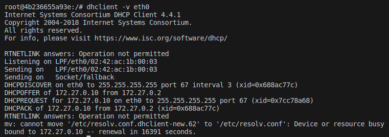
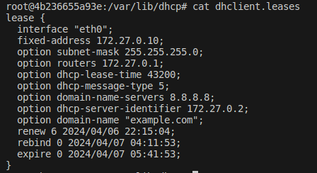
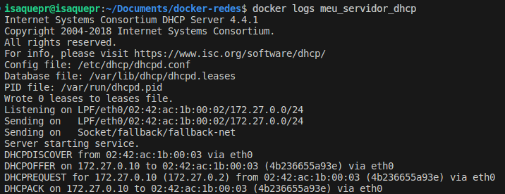
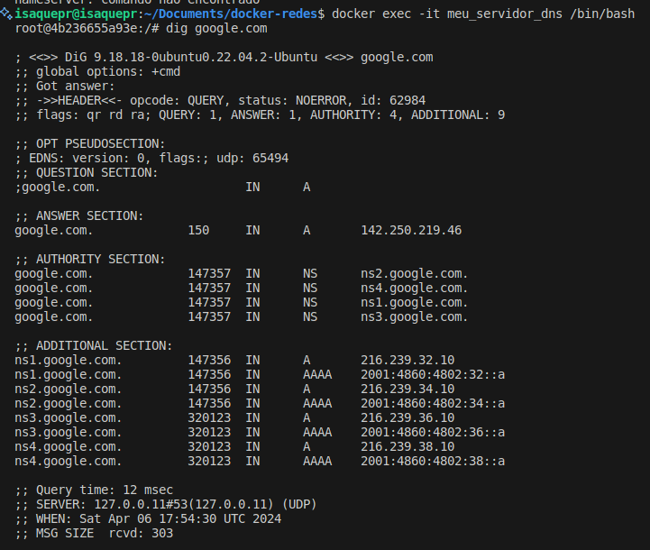
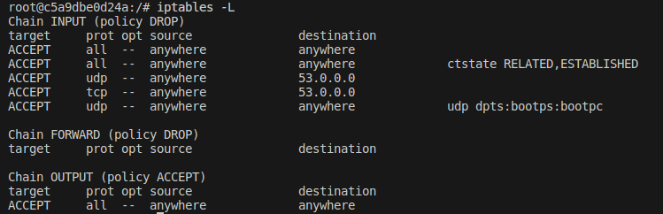
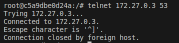

# Exercício de Configuração de Rede em Docker

Cenário: Você foi designado para configurar um ambiente de rede em Docker para uma empresa fictícia. Este ambiente deve incluir serviços essenciais de rede, como DHCP, DNS e Firewall, para garantir conectividade e segurança adequadas. Você deve configurar cada serviço em um container Docker separado e garantir que eles se comuniquem adequadamente entre si. Além disso, é necessário criar Dockerfiles para cada imagem necessária, com base na imagem ubuntu:latest, e realizar testes para validar a configuração da rede.
Roteiro

1. Configurar um servidor DHCP em um container Docker.
2. Configurar um servidor DNS em um container Docker.
3. Configurar um firewall em um container Docker para proteger a rede.
4. Garantir a interação entre os containers para permitir a comunicação adequada entre DHCP, DNS e firewall.
5. Criar Dockerfiles para cada imagem necessária, utilizando como base a imagem ubuntu:latest, e incluir todas as configurações e dependências necessárias.
6. Realizar testes para garantir que a configuração da rede esteja funcionando corretamente, incluindo testes de conectividade, resolução de nomes de domínio e aplicação das regras de firewall.


## Descrição dos Arquivos
```bash
docker-redes
├── dhcpd.conf
├── dockerfile.dhcp
├── dockerfile.dns
├── dockerfile.firewall
├── exe.sh
├── firewall_rules.sh
├── named.conf.options
└── README.md
0 directories, 8 files
```
#### dhcpd.conf

O arquivo `dhcpd.conf` contém a configuração para o servidor DHCP. Aqui está uma descrição linha por linha do que o arquivo faz:

- `# Configuração do servidor DHCP para a sub-rede 172.27.0.0/24`: Este é um comentário que descreve a finalidade do arquivo.

- `subnet 172.27.0.0 netmask 255.255.255.0 {`: Esta linha inicia a definição da sub-rede para a qual o servidor DHCP fornecerá endereços IP.

- `range 172.27.0.10 172.27.0.100;`: Esta linha define a faixa de endereços IP que o servidor DHCP pode atribuir a clientes.

- `option routers 172.27.0.1;`: Esta linha define o endereço IP do roteador padrão que será fornecido aos clientes.

- `option domain-name-servers 8.8.8.8;`: Esta linha define os servidores DNS que serão fornecidos aos clientes.

- `option domain-name "example.com";`: Esta linha define o nome de domínio que será fornecido aos clientes.

- `interface eth0;`: Esta linha especifica a interface de rede que o servidor DHCP usará.

- `}`: Esta linha termina a definição da sub-rede.

#### dockerfile.dhcp

Este Dockerfile configura um servidor DHCP usando o pacote `isc-dhcp-server` no Ubuntu. Aqui está uma descrição linha por linha do que o Dockerfile faz:

- `FROM ubuntu:latest`: Esta linha especifica a imagem base que será usada, que neste caso é a última versão do Ubuntu.

- `RUN apt-get update && apt-get install -y isc-dhcp-server`: Esta linha atualiza o repositório de pacotes e instala o pacote `isc-dhcp-server`.

- `RUN mkdir -p /var/lib/dhcp/ && touch /var/lib/dhcp/dhcpd.leases && chmod 666 /var/lib/dhcp/dhcpd.leases`: Esta linha cria o diretório e o arquivo necessário para `dhcpd.leases` e define as permissões apropriadas.

- `COPY ./dhcpd.conf /etc/dhcp/dhcpd.conf`: Esta linha copia o arquivo `dhcpd.conf` para o local apropriado no contêiner.

- `EXPOSE 67/udp`: Esta linha expõe a porta 67 para tráfego DHCP.

- `CMD ["dhcpd", "-f", "-d", "--no-pid"]`: Esta linha inicia o servidor DHCP com as opções especificadas.

#### dockerfile.dns
Este Dockerfile configura um servidor DNS usando o pacote `bind9` no Ubuntu. Aqui está uma descrição linha por linha do que o Dockerfile faz:

- `FROM ubuntu:latest`: Esta linha especifica a imagem base que será usada, que neste caso é a última versão do Ubuntu.

- `RUN apt-get update && apt-get install -y bind9 dnsutils isc-dhcp-client`: Esta linha atualiza o repositório de pacotes e instala os pacotes `bind9`, `dnsutils` e `isc-dhcp-client`.

- `COPY ./named.conf.options /etc/bind/named.conf.options`: Esta linha copia o arquivo `named.conf.options` para o local apropriado no contêiner.

- `EXPOSE 53/tcp`: Esta linha expõe a porta 53 para tráfego TCP.

- `EXPOSE 53/udp`: Esta linha expõe a porta 53 para tráfego UDP.

- `CMD ["/usr/sbin/named", "-g", "-c", "/etc/bind/named.conf", "-u", "bind"]`: Esta linha inicia o servidor DNS com as opções especificadas.

#### dockerfile.firewall

Este Dockerfile configura um servidor Firewall usando o pacote `iptables` no Ubuntu. Aqui está uma descrição linha por linha do que o Dockerfile faz:

- `FROM ubuntu:latest`: Esta linha especifica a imagem base que será usada, que neste caso é a última versão do Ubuntu.

- `RUN apt-get update && apt-get install -y iptables dnsutils net-tools isc-dhcp-client && apt install -y telnet`: Esta linha atualiza o repositório de pacotes e instala os pacotes `iptables`, `dnsutils`, `net-tools`, `isc-dhcp-client` e `telnet`.

- `COPY ./firewall_rules.sh /root/firewall_rules.sh`: Esta linha copia o arquivo `firewall_rules.sh` para o local apropriado no contêiner.

- `RUN chmod 755 /root/firewall_rules.sh`: Esta linha define o script `firewall_rules.sh` como executável.

- `CMD ["/bin/bash", "-c", "/root/firewall_rules.sh; sleep infinity"]`: Esta linha inicia o script de firewall e mantém o contêiner em execução indefinidamente.

#### exe.sh
O script `exe.sh` automatiza a construção e execução dos contêineres Docker para os servidores DHCP, DNS e Firewall.

#### firewall_rules.sh

O script `firewall_rules.sh` configura as regras do firewall no servidor Firewall. Aqui está uma descrição linha por linha do que o script faz:

- `#!/bin/bash`: Esta linha especifica que o script deve ser executado usando o interpretador de comandos Bash.

- `iptables -F` e `iptables -X`: Estas linhas limpam todas as regras de firewall existentes.

- `iptables -P INPUT DROP`, `iptables -P FORWARD DROP` e `iptables -P OUTPUT ACCEPT`: Estas linhas definem as políticas padrão para as cadeias INPUT, FORWARD e OUTPUT.

- `iptables -A INPUT -i lo -j ACCEPT` e `iptables -A OUTPUT -o lo -j ACCEPT`: Estas linhas permitem todo o tráfego na interface de loopback.

- `iptables -A INPUT -m conntrack --ctstate RELATED,ESTABLISHED -j ACCEPT`: Esta linha permite todas as conexões já estabelecidas e relacionadas.

- `iptables -A INPUT -p udp -d 53 -j ACCEPT` e `iptables -A INPUT -p tcp -d 53 -j ACCEPT`: Estas linhas permitem todo o tráfego UDP e TCP para a porta 53 (DNS).

- `iptables -A INPUT -p udp --dport 67:68 -j ACCEPT`: Esta linha permite todo o tráfego UDP para as portas 67 e 68 (DHCP).

- `iptables -L`: Esta linha lista todas as regras de firewall atualmente em vigor.

#### named.conf.options

O arquivo `named.conf.options` contém as opções de configuração para o servidor DNS BIND. Aqui está uma descrição linha por linha do que o arquivo faz:

- `directory "/var/cache/bind";`: Esta linha define o diretório onde o BIND armazena os arquivos de cache.

- `forwarders { 8.8.8.8; 8.8.4.4; };`: Esta linha define os servidores DNS para os quais as consultas serão encaminhadas. Neste caso, são os servidores DNS do Google.

- `allow-query { any; };`: Esta linha define as permissões de consulta para os clientes. Neste caso, qualquer cliente pode fazer consultas.

#### README.md
Documentação do Projeto.

## Exercícios (Testes) 
1. Inicie os containers Docker para cada serviço (DHCP, DNS e Firewall). 
2. Teste a atribuição de endereços IP pelo servidor DHCP em uma máquina cliente.
3. Teste a resolução de nomes de domínio pelo servidor DNS.
4. Teste a conectividade entre os dispositivos na rede considerando as regras do firewall.

## Testes
#### Execução

Para iniciar os contêineres Docker para cada serviço (DHCP, DNS e Firewall), siga os passos abaixo:

1. Certifique-se de que você tem o git e o Docker instalado e configurado corretamente em sua máquina.

2. Clone o diretorio na sua maquina

```bash
git clone https://github.com/isaqwe/docker-redes.git
```

3. Navegue até o diretório  `docker-redes` e abra o terminal nele.

4. Torne o script `exe.sh` executável com o seguinte comando:

```bash
chmod +x exe.sh
```

5. Execute o script `exe.sh` com o seguinte comando:

```bashs
./exe.sh
```

Este script irá construir as imagens Docker para cada serviço usando os Dockerfiles correspondentes e executará um contêiner Docker para cada serviço. Cada contêiner será conectado à rede Docker `minha_rede`.

6. Verifique se os contêineres estão em execução com o seguinte comando:

```bash
docker ps
```

Você deve ver um contêiner para cada serviço (DHCP, DNS e Firewall) na saída deste comando.


### Teste a atribuição de endereços IP pelo servidor DHCP em uma máquina cliente.

Para testar a atribuição de endereços IP pelo servidor DHCP em um contêiner cliente (DNS ou Firewall), siga os passos abaixo:

1. Entre no contêiner cliente com o seguinte comando:

```bash
docker exec -it meu_servidor_dns /bin/bash
```

2. Solicite um IP ao servidor DHCP com o seguinte comando:

```bash
dhclient -v eth0
```

Neste comando, `eth0` é o nome da interface de rede que você deseja configurar. Substitua `eth0` pelo nome apropriado da sua interface de rede.



3. Verifique o arquivo `/var/lib/dhcp/dhclient.leases`, que contém as atribuições de IP, com o seguinte comando:

```bash
cat /var/lib/dhcp/dhclient.leases
```


4. Verifique se o servidor DHCP recebeu a solicitação de IP com o seguinte comando:

```bash
docker logs meu_servidor_dhcp
```



### Teste a resolução de nomes de domínio pelo servidor DNS.

Para testar a resolução de nomes de domínio pelo servidor DNS, siga os passos abaixo:

1. Entre no contêiner cliente com o seguinte comando:

```bash
docker exec -it meu_servidor_dns /bin/bash
```

2. Teste a resolução de nomes de domínio com o comando `dig`. Por exemplo, para testar a resolução do domínio `google.com`, você pode usar o seguinte comando:

```bash
dig google.com
```


Se o servidor DNS estiver configurado corretamente, você deve ver uma resposta do servidor DNS na saída deste comando. A resposta deve incluir o endereço IP para o domínio que você testou.

#### Teste a conectividade entre os dispositivos na rede considerando as regras do firewall.

Para testar a conectividade entre os dispositivos na rede considerando as regras do firewall, siga os passos abaixo:


1. Entre no contêiner firewall com o seguinte comando:

```bash
docker exec -it meu_servidor_firewall /bin/bash
```

2. Verifique as portas bloqueadas e liberadas com o seguinte comando:

```bash
iptables -L
```




Este comando irá listar todas as regras do firewall atualmente em vigor. Você pode usar esta lista para verificar quais portas estão bloqueadas e quais estão liberadas.


**Isaque Pontes Romualdo, 5º Sistemas de Informação - Serviços de Redes de Computadores**